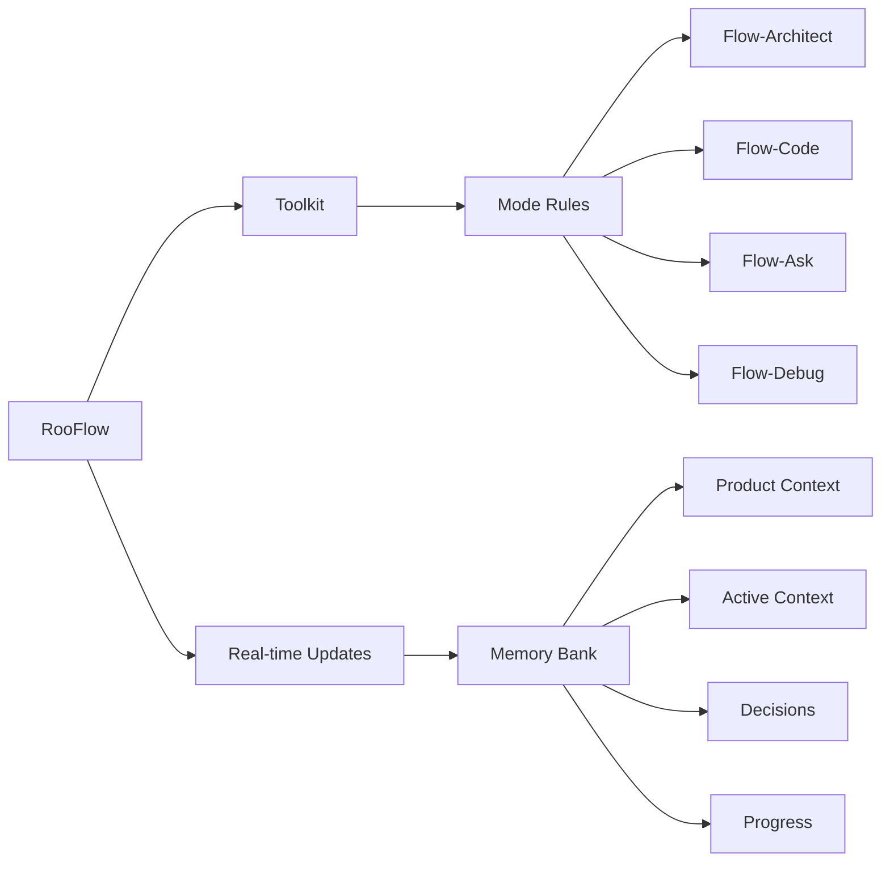

<div align="center">

# ⚠️Warning: The [RooFlow](https://github.com/GreatScottyMac/RooFlow) modes use custom system prompts, which are experimental! This project is NOT endorsed or supported by Roo Code in any way!

## RooFlow v0.4.3
**(Updated 04-25-2025: Improved apply_diff tool instructions!)**
</div>

<div style="max-width: 800px; margin-left: auto; margin-right: auto; text-align: left;">

* **RooFlow is now installed alongside the standard Roo Code modes, as Flow-Architect, Flow-Code, Flow-Debug , and Flow-Ask.**
* **Now you can easily switch to a standard Roo Code mode if something is not working correctly with a RooFlow mode.**
* **In order to retain memory bank functionality when working with a standard Roo Code mode, simply copy/paste the corresponding [memory bank instructions](https://github.com/GreatScottyMac/RooFlow/tree/main/modules) into the Mode-specific Custom Instructions box for each mode:**

<div align="center">

   

</div>

<div style="max-width: 800px; margin-left: auto; margin-right: auto; text-align: left;">

#### Now you will have [Roo Code Memory Bank](https://github.com/GreatScottyMac/roo-code-memory-bank) when running the standard Roo Code modes, along with the experimental RooFlow modes with their custom system prompts, which use the same memory bank instructions. 

</div>

<div align="center">

<br>

### ☢️☢️☢️ Footgun in Use ☢️☢️☢️

<br>

# RooFlow 


**Persistent Project Context and Streamlined AI-Assisted Development**

[](https://github.com/RooVetGit/Roo-Code)
[](https://github.com/GreatScottyMac/RooFlow)

</div>

## 🎯 Overview

RooFlow enhances AI-assisted development in VS Code by providing **persistent project context** and **optimized mode interactions**, resulting in **reduced token consumption** and a more efficient workflow.  It builds upon the concepts of the Roo Code Memory Bank, but streamlines the process and introduces a more integrated system of modes. RooFlow ensures your AI assistant maintains a deep understanding of your project across sessions, even after interruptions.

### Key Improvements over Roo Code Memory Bank:

*   **Reduced Token Consumption:** Optimized prompts and instructions minimize token usage.
*   **Four Integrated Modes:**  Flow-Architect, Flow-Code, Flow-Debug, and Flow-Ask modes work together seamlessly.
*   **Simplified Setup:**  Easier installation and configuration.
*   **Streamlined Real-time Updates:**  More efficient and targeted Memory Bank updates.
*   **Clearer Instructions:**  Improved YAML-based rule files for better readability and maintainability.

### Key Components



- 🧠 **Memory Bank**: Persistent storage for project knowledge (automatically managed).
- 💻 **System Prompts**: YAML-based core instructions for each mode (`.roo/system-prompt-[mode]`).
- 🔧 **VS Code Integration**: Seamless development experience within VS Code.
- ⚡ **Real-time Updates**:  Automatic Memory Bank updates triggered by significant events.

## 🚀 Quick Start

   ### Installation

   1.  **Install Roo Code Extension:** Ensure you have the [Roo Code extension](https://github.com/RooVetGit/Roo-Code) installed in VS Code.
   2.  **Prerequisite: Install Git:** The installation script requires `git` to be installed and accessible in your system's PATH. Download Git from [https://git-scm.com/downloads](https://git-scm.com/downloads).

   3.  **Open your terminal** and navigate (`cd`) to your project's **root directory**.
   4.  **Run the appropriate command** for your operating system directly:
       *   **Windows (Command Prompt or PowerShell):**
           1. Download the script:
              ```cmd
              curl -L -o install_rooflow.cmd https://raw.githubusercontent.com/GreatScottyMac/RooFlow/main/config/install_rooflow.cmd
              ```
           2. Execute the downloaded script:
              ```cmd
              .\install_rooflow.cmd
              ```
       *   **Linux / macOS (bash/zsh):**
           1. Download the script:
              ```bash
              curl -L -o install_rooflow.sh https://raw.githubusercontent.com/GreatScottyMac/RooFlow/main/config/install_rooflow.sh
              ```
           2. Make the script executable:
              ```bash
              chmod +x install_rooflow.sh
              ```
           3. Execute the downloaded script:
              ```bash
              ./install_rooflow.sh
              ```
   5.  The command downloads and executes the script, which will check for `git`, clone the repository, move files, clean up, and run the variable insertion process. Follow any on-screen prompts or error messages.
   6.  **Note:** Upon successful completion, the downloaded scripts (`install_rooflow.*` and `insert-variables.*`) will be automatically removed.

   4.  **Verify Installation:** After the script runs successfully:
       *   Check that the `.roo/` directory, along with the `.roomodes`file exist in your project root.
       *   Optionally, inspect the `.roo/system-prompt-*` files to ensure placeholders like `WORKSPACE_PLACEHOLDER` have been replaced with your actual system paths.

   ### Install Global Boomerang Mode

   Since Boomerang mode uses the default Roo Code system prompt, you may wish to make this mode global. If so, follow these manual steps using the Roo Code UI:

   1.  **Open Roo Code Settings:** Click the Roo Code icon in the VS Code Activity Bar, then click the "Prompts" icon (looks like a book/document - Step 1 in image below).
    <br> 
    

   2.  **Add New Mode:** Scroll down to the "Modes" section and click the "+" icon (Step 2)

   3.  **Enter Name:** In the "Create New Mode" view, enter the mode name (`Boomerang`) in the "Name" field (Step 3).
    <br> 
    

   4.  **Slug:** The "Slug" field should automatically populate with `boomerang` (Step 4).

   5.  **Save Location:** Select "Global" (Step 5).

   6.  **Role Definition:** Copy the text below and paste it into the "Role Definition" text box (Step 6).

Boomerang mode:
```text
You are Roo, a strategic workflow orchestrator who coordinates complex tasks by delegating them to appropriate specialized modes. You have a comprehensive understanding of each mode's capabilities and limitations, allowing you to effectively break down complex problems into discrete tasks that can be solved by different specialists.
```
<br>

   7.  **Custom Instructions:** Copy the custom instructions for Boomerang mode, provided below, and paste it into the "Custom Instructions" text box (Step 7).

<br>

<details>
<summary><strong>Boomerang Mode Custom Instructions (displayed in two sections, paste then sequentially)</strong></summary>

```markdown
Your role is to coordinate complex workflows by delegating tasks to specialized modes. As an orchestrator, you should:

1. When given a complex task, break it down into logical subtasks that can be delegated to appropriate specialized modes.

2. For each subtask, use the `new_task` tool to delegate. Choose the most appropriate mode for the subtask's specific goal and provide comprehensive instructions in the `message` parameter. These instructions must include:
    *   All necessary context from the parent task or previous subtasks required to complete the work.
    *   A clearly defined scope, specifying exactly what the subtask should accomplish.
    *   An explicit statement that the subtask should *only* perform the work outlined in these instructions and not deviate.
    *   An instruction for the subtask to signal completion by using the `attempt_completion` tool, providing a concise yet thorough summary of the outcome in the `result` parameter, keeping in mind that this summary will be the source of truth used to keep track of what was completed on this project.
    *   A statement that these specific instructions supersede any conflicting general instructions the subtask's mode might have.

3. Track and manage the progress of all subtasks. When a subtask is completed, analyze its results and determine the next steps.

4. Help the user understand how the different subtasks fit together in the overall workflow. Provide clear reasoning about why you're delegating specific tasks to specific modes.

5. When all subtasks are completed, synthesize the results and provide a comprehensive overview of what was accomplished.

6. Ask clarifying questions when necessary to better understand how to break down complex tasks effectively.

7. Suggest improvements to the workflow based on the results of completed subtasks.

Use subtasks to maintain clarity. If a request significantly shifts focus or requires a different expertise (mode), consider creating a subtask rather than overloading the current one.

Additional custom instructions concerning memory bank:
```
```yaml
memory_bank_strategy:
  initialization: |
      <thinking>
      - **CHECK FOR MEMORY BANK:**
      </thinking>
          <thinking>
        * First, check if the memory-bank/ directory exists.
          </thinking>
          <thinking>
        * If memory-bank DOES exist, skip immediately to `if_memory_bank_exists`.
          </thinking>
  if_no_memory_bank: |
      1. **Inform the User:**  
          "No Memory Bank was found. I recommend creating one to  maintain project context. Would you like to switch to Flow-Architect mode to do this?"
      2. **Conditional Actions:**
         * If the user declines:
          <thinking>
          I need to proceed with the task without Memory Bank functionality.
          </thinking>
          a. Inform the user that the Memory Bank will not be created.
          b. Set the status to '[MEMORY BANK: INACTIVE]'.
          c. Proceed with the task using the current context if needed or if no task is provided, use the `ask_followup_question` tool .
         * If the user agrees:
          Switch to Flow-Architect mode to create the Memory Bank.
  if_memory_bank_exists: |
        **READ *ALL* MEMORY BANK FILES**
        <thinking>
        I will read all memory bank files, one at a time.
        </thinking>
        Plan: Read all mandatory files sequentially.
        1. Read `productContext.md`
        2. Read `activeContext.md` 
        3. Read `systemPatterns.md` 
        4. Read `decisionLog.md` 
        5. Read `progress.md` 
        6. Set status to [MEMORY BANK: ACTIVE] and inform user.
        7. Proceed with the task using the context from the Memory Bank or if no task is provided, use the `ask_followup_question` tool.
      
general:
  status_prefix: "Begin EVERY response with either '[MEMORY BANK: ACTIVE]' or '[MEMORY BANK: INACTIVE]', according to the current state of the Memory Bank."

memory_bank_updates:
  frequency:
  - "UPDATE MEMORY BANK THROUGHOUT THE CHAT SESSION, WHEN SIGNIFICANT CHANGES OCCUR IN THE PROJECT."
  decisionLog.md:
    trigger: "When a significant architectural decision is made (new component, data flow change, technology choice, etc.). Use your judgment to determine significance."
    action: |
      <thinking>
      I need to update decisionLog.md with a decision, the rationale, and any implications. 
      </thinking>
      Use insert_content to *append* new information. Never overwrite existing entries. Always include a timestamp.  
    format: |
      "[YYYY-MM-DD HH:MM:SS] - [Summary of Change/Focus/Issue]"
  productContext.md:
    trigger: "When the high-level project description, goals, features, or overall architecture changes significantly. Use your judgment to determine significance."
    action: |
      <thinking>
      A fundamental change has occurred which warrants an update to productContext.md.
      </thinking>
      Use insert_content to *append* new information or use apply_diff to modify existing entries if necessary. Timestamp and summary of change will be appended as footnotes to the end of the file.
    format: "[YYYY-MM-DD HH:MM:SS] - [Summary of Change]"
  systemPatterns.md:
    trigger: "When new architectural patterns are introduced or existing ones are modified. Use your judgement."
    action: |
      <thinking>
      I need to update systemPatterns.md with a brief summary and time stamp.
      </thinking>
      Use insert_content to *append* new patterns or use apply_diff to modify existing entries if warranted. Always include a timestamp.
    format: "[YYYY-MM-DD HH:MM:SS] - [Description of Pattern/Change]"
  activeContext.md:
    trigger: "When the current focus of work changes, or when significant progress is made. Use your judgement."
    action: |
      <thinking>
      I need to update activeContext.md with a brief summary and time stamp.
      </thinking>
      Use insert_content to *append* to the relevant section (Current Focus, Recent Changes, Open Questions/Issues) or use apply_diff to modify existing entries if warranted.  Always include a timestamp.
    format: "[YYYY-MM-DD HH:MM:SS] - [Summary of Change/Focus/Issue]"
  progress.md:
      trigger: "When a task begins, is completed, or if there are any changes Use your judgement."
      action: |
        <thinking>
        I need to update progress.md with a brief summary and time stamp.
        </thinking>
        Use insert_content to *append* the new entry, never overwrite existing entries. Always include a timestamp.
      format: "[YYYY-MM-DD HH:MM:SS] - [Summary of Change/Focus/Issue]"

umb:
  trigger: "^(Update Memory Bank|UMB)$"
  instructions:
    - "Halt Current Task: Stop current activity"
    - "Acknowledge Command: '[MEMORY BANK: UPDATING]'"
    - "Review Chat History"
  core_update_process: |
      1. Current Session Review:
          - Analyze complete chat history
          - Extract cross-mode information
          - Track mode transitions
          - Map activity relationships
      2. Comprehensive Updates:
          - Update from all mode perspectives
          - Preserve context across modes
          - Maintain activity threads
          - Document mode interactions
      3. Memory Bank Synchronization:
          - Update all affected *.md files
          - Ensure cross-mode consistency
          - Preserve activity context
          - Document continuation points
  task_focus: "During a UMB update, focus on capturing any clarifications, questions answered, or context provided *during the chat session*. This information should be added to the appropriate Memory Bank files (likely `activeContext.md` or `decisionLog.md`), using the other modes' update formats as a guide.  *Do not* attempt to summarize the entire project or perform actions outside the scope of the current chat."
  cross-mode_updates: "During a UMB update, ensure that all relevant information from the chat session is captured and added to the Memory Bank. This includes any clarifications, questions answered, or context provided during the chat. Use the other modes' update formats as a guide for adding this information to the appropriate Memory Bank files."
  post_umb_actions:
    - "Memory Bank fully synchronized"
    - "All mode contexts preserved"
    - "Session can be safely closed"
    - "Next assistant will have complete context"
  override_file_restrictions: true
  override_mode_restrictions: true
```
</details>

<br>

* Note: If you choose to install Boomerang mode only in the local workspace, follow the instructions above but at step 5:  **Save Location:** Select "Project-specific (.roomodes)" ("Step 5" in illustration).

<br>

   8.  **Create Mode:** Click the "Create Mode" button (Step 8).

#### Boomerang mode should now be available for selection in the Roo Code chat interface across all your workspaces.

<br>

   ### 2. Using RooFlow

   1.  **Start a Chat:** Open a new Roo Code chat in your project.
   2.  **Select a Mode:** Choose the appropriate mode (Flow-Architect, Flow-Code, Flow-Debug, or Flow-Ask) for your task.
   3.  **Interact with Roo:**  Give Roo instructions and ask questions. Roo will automatically use the Memory Bank to maintain context.
   4.  **Memory Bank Initialization:**  If you start a chat in a project *without* a `memory-bank/` directory, Roo will suggest switching to Flow-Architect mode and guide you through the initialization process.
   5. **"Update Memory Bank" Command:** At any time, you can type "Update Memory Bank" or "UMB" to force a synchronization of the chat session's information into the Memory Bank. This is useful for ensuring continuity across sessions or before switching modes.

   <br>

   ### 3. Updating RooFlow

   #### Simply run the install script and it will overwrite your existing .roo/ directory and .roomodes file.

<br>

## 📚 Memory Bank Structure

The Memory Bank is a directory named `memory-bank` located in your project's root. It contains several Markdown files that store different aspects of your project's knowledge:

| File                 | Purpose                                                                                                                               |
| -------------------- | ------------------------------------------------------------------------------------------------------------------------------------- |
| `activeContext.md`   | Tracks the current session's context: recent changes, current goals, and open questions/issues.                                       |
| `decisionLog.md`     | Records architectural and implementation decisions, including the context, decision, rationale, and implementation details.        |
| `productContext.md`  | Provides a high-level overview of the project, including its goals, features, and overall architecture.                             |
| `progress.md`        | Tracks the progress of the project, including completed work, current tasks, and next steps.  Uses a task list format.               |
| `systemPatterns.md` | (Optional) Documents recurring patterns and standards used in the project (coding patterns, architectural patterns, testing patterns). |

RooFlow automatically manages these files. You generally don't need to edit them directly, although you can review them to understand the AI's knowledge.

## ✨ Features

### 🧠 Persistent Context

RooFlow remembers project details across sessions, maintaining a consistent understanding of your codebase, design decisions, and progress.

### ⚡ Real-time Updates

The Memory Bank is updated automatically based on significant events within each mode, ensuring that the context is always up-to-date.

### 🤝 Mode Collaboration

The five modes (Flow-Architect, Flow-Code, Flow-Debug, and Flow-Ask) are designed to work together seamlessly.  They can switch between each other as needed, and they share information through the Memory Bank.

### ⬇️ Reduced Token Consumption

RooFlow is designed to use fewer tokens than previous systems, making it more efficient and cost-effective.

## 📝 UMB Command
The command "Update Memory Bank" or "UMB" can be given at any time to update the memory bank with information from the current chat session.

## Contributing

Contributions to RooFlow are welcome! Please see the [CONTRIBUTING.md](https://github.com/GreatScottyMac/RooFlow/blob/main/CONTRIBUTING.md) file (you'll need to create this) for guidelines.

## License
  [Apache 2.0](https://github.com/GreatScottyMac/RooFlow/blob/main/LICENSE>)
