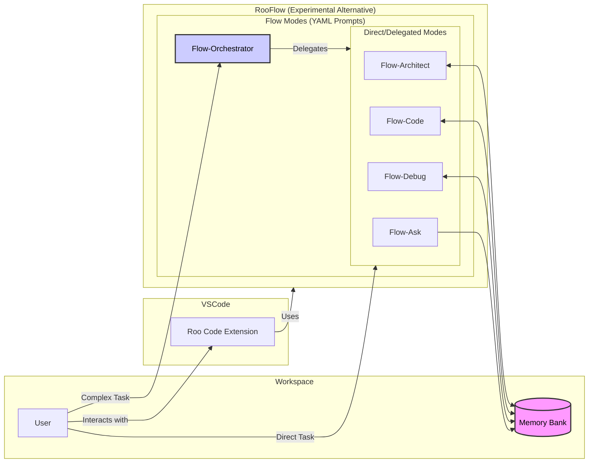

<div align="center">

## ⚠️ Alternate System Prompt Format for Roo Code ⚠️

**RooFlow provides an *experimental* set of modes and system prompts designed as an alternative way to interact with the [Roo Code](https://github.com/RooVetGit/Roo-Code) VS Code extension.** It uses YAML-based system prompts aiming for improved efficiency and token usage compared to the standard Markdown prompts. RooFlow is NOT officially endorsed or supported by the Roo Code project. Use with caution.

### ✨Now with optional installation for use with the new [Context Portal MCP](https://github.com/GreatScottyMac/context-portal)!!✨

<br>

# RooFlow 


**Persistent Project Context and Streamlined AI-Assisted Development**

[](https://github.com/RooVetGit/Roo-Code)
[](https://github.com/GreatScottyMac/RooFlow)

</div>

## 🎯 Overview

RooFlow offers an **experimental alternative** approach to AI-assisted development within the **[Roo Code](https://github.com/RooVetGit/Roo-Code) VS Code extension**. It utilizes **YAML-based system prompts** for its specialized "Flow" modes, potentially offering **improved efficiency and reduced token consumption** compared to standard modes. RooFlow provides **persistent project context** through its Memory Bank system (adapted from the concepts in [roo-code-memory-bank](https://github.com/GreatScottyMac/roo-code-memory-bank)), ensuring the AI assistant maintains project understanding across sessions.

### Key Improvements over Roo Code Memory Bank:

*   **Reduced Token Consumption:** Optimized prompts and instructions minimize token usage.
*   **Five Integrated Modes:** Flow-Architect, Flow-Code, Flow-Debug, Flow-Ask, and Flow-Orchestrator modes work together seamlessly.
*   **Simplified Setup:**  Easier installation and configuration.
*   **Streamlined Real-time Updates:**  More efficient and targeted Memory Bank updates.
*   **Clearer Instructions:**  Improved YAML-based rule files for better readability and maintainability.

### Key Components



**Memory Bank Access Legend:**
*   `<-->` (Read/Write): Flow-Architect, Flow-Code, Flow-Debug
*   `-->` (Read-Only): Flow-Ask


- 🧠 **Memory Bank**: Persistent storage for project knowledge (automatically managed).
- 💻 **System Prompts**: YAML-based core instructions for each mode (`.roo/system-prompt-[mode]`).
- 🔧 **VS Code Integration**: Seamless development experience within VS Code.
- ⚡ **Real-time Updates**:  Automatic Memory Bank updates triggered by significant events.

## 🚀 Quick Start

   ### Installation

   1.  **Install Roo Code Extension:** Ensure you have the [Roo Code extension](https://github.com/RooVetGit/Roo-Code) installed in VS Code.
   2.  **Prerequisites:**
       *   **Git:** The installation script requires `git` to be installed and accessible in your system's PATH. Download Git from [https://git-scm.com/downloads](https://git-scm.com/downloads).
       *   **Python 3:** The script now uses Python directly. Ensure Python 3 is installed and accessible as `python3` (Linux/macOS) or `python` (Windows) in your PATH. Download Python from [https://www.python.org/downloads/](https://www.python.org/downloads/).
       *   **PyYAML:** The Python script requires the PyYAML library. Install it using pip:
           ```bash
           pip install pyyaml
           # or potentially pip3 install pyyaml
           ```
   3.  **Open your terminal** and navigate (`cd`) to your project's **root directory**.
   4.  **Run the appropriate command** for your operating system directly:
       *   **Windows (Command Prompt or PowerShell):**
           1. Download the script

              **For Use With File Based Memory Bank:**
              ```cmd
              curl -L -o install_rooflow.cmd https://raw.githubusercontent.com/GreatScottyMac/RooFlow/main/config/install_rooflow.cmd
              ```
              **For Use With [Context Portal MCP](https://github.com/GreatScottyMac/context-portal):**
              ```cmd
              curl -L -o install_rooflow_conport.cmd https://raw.githubusercontent.com/GreatScottyMac/RooFlow/main/config/install_rooflow_conport.cmd
              ```
           2. Execute the downloaded script (⚠️If you have MCP servers connected, see [Importing Connected MCP Server Tools](https://github.com/GreatScottyMac/RooFlow?tab=readme-ov-file#importing-connected-mcp-server-tools-optional) prior to installation):
              ```cmd
                  (Memory Bank)     or      (Context Portal MCP)
              .\install_rooflow.cmd    .\install_rooflow_conport.cmd
              ```
       *   **Linux / macOS (bash/zsh):**
           1. Download the script

              **For Use With File Based Memory Bank:**
              ```cmd
              curl -L -o install_rooflow.cmd https://raw.githubusercontent.com/GreatScottyMac/RooFlow/main/config/install_rooflow.sh
              ```
              **For Use With [Context Portal MCP](https://github.com/GreatScottyMac/context-portal):**
              ```cmd
              curl -L -o install_rooflow_conport.cmd https://raw.githubusercontent.com/GreatScottyMac/RooFlow/main/config/install_rooflow_conport.sh
              ```
           2. Make the script executable:
              ```bash
              chmod +x install_rooflow.sh

              or  

              chmod +x install_rooflow_conport.sh
              ```
           3. Execute the downloaded script (⚠️If you have MCP servers connected, see [Importing Connected MCP Server Tools](https://github.com/GreatScottyMac/RooFlow?tab=readme-ov-file#importing-connected-mcp-server-tools-optional) prior to installation):
              ```bash
              ./install_rooflow.sh

              or 

              ./install_rooflow_conport.sh
              ```
   5.  The command downloads and executes the script, which will check for prerequisites (`git`, `python3`/`python`, `pyyaml`), clone the repository, copy necessary files (including `generate_mcp_yaml.py`), clean up the clone, and run the Python script to process templates. Follow any on-screen prompts or error messages.
   6.  **Note:** The installer script (`install_rooflow.*`) is designed to remain after execution for potential re-runs (e.g., for updates).

   7.  **Verify Installation:** After the script runs successfully:
       *   Check that the `.roo/` directory, along with the `.roomodes`file exist in your project root.
       *   Optionally, inspect the `.roo/system-prompt-*` files to ensure placeholders like `WORKSPACE_PLACEHOLDER` have been replaced with your actual system paths.
   8.  **Coexistence with Standard Modes:** The RooFlow installation adds the `Flow-*` modes alongside the standard Roo Code modes (Architect, Code, Debug, Ask). You can switch between Flow modes and standard modes at any time using the Roo Code interface. If you encounter issues with a Flow mode, you can easily switch back to its standard counterpart.

   ### Importing Connected MCP Server Tools (Optional)

   If you use [MCP (Model Context Protocol)](https://github.com/modelcontextprotocol/specification) servers with Roo Code, RooFlow can automatically inject the details of your connected servers (their tools, resources, etc.) into the custom Flow mode prompts during installation. This ensures the Flow modes are aware of the same tools as the standard Roo Code modes.

   **To enable this during initial installation:**

   1.  **Get Full System Prompt:** *Before* running the RooFlow installer, you need the complete system prompt text that Roo Code generates dynamically *after* it connects to your MCP servers.
       *   Navigate to Extensions -> Roo Code -> Prompts (as shown in illustration below).
       <br/>
       

       *   Select any *standard* Roo Code mode (e.g., "Architect", "Code", "Ask", "Debug").
       *   Click the "Copy system prompt to clipboard" button (as shown in illustration above).
       *   This text includes the dynamically discovered information about your *currently connected* MCP servers.
   2.  **Save as `system_prompt.md`:** Save this copied text into a new file named exactly `system_prompt.md` directly in your project's **root directory**.
   3.  **Run Installer:** Now, run the `install_rooflow.sh` or `install_rooflow.cmd` script as described in the main Installation section above.
       *   The installer copies the Python script `generate_mcp_yaml.py`.
       *   It then runs this Python script (using `python3` or `python`). The script automatically looks for `system_prompt.md` in the root directory.
       *   If found, the Python script parses the MCP server details from it, converts them to YAML, and injects them into the appropriate placeholder (`# [CONNECTED_MCP_SERVERS]`) within the `.roo/system-prompt-flow-*` files while also performing other variable substitutions.
       *   If `system_prompt.md` is not found, this injection step is simply skipped.

   **Updating MCP Server Information Later:**

   If you add, remove, or modify your MCP server configurations after the initial RooFlow installation, you'll need to update the Flow mode prompts:

   1.  **Get Updated Prompt:** Ensure your desired MCP servers are connected in Roo Code. Go back to Roo Code settings and copy the *latest* full system prompt text (which includes the updated MCP details) from a standard mode, just like in the initial setup.
   2.  **Save Updated `system_prompt.md`:** Save this new text into `system_prompt.md` in your project root, overwriting the previous version.
   3.  **Re-run Installer:** Execute the `install_rooflow.sh` or `install_rooflow.cmd` script again from your project root.
       *   This script will copy the latest base configuration (`.roo/` files, `.roomodes`, `generate_mcp_yaml.py`) from the repository *and* run the `generate_mcp_yaml.py` Python script again.
       *   The Python script will read your updated `system_prompt.md` and inject the new MCP server details into the freshly copied `.roo/system-prompt-flow-*` files (along with performing basic variable substitutions).

   **⚠️ Important Warning about Updates:** Re-running the installer script is the simplest way to update MCP info, but be aware that it **overwrites** the `.roo/` directory and the `.roomodes` file with fresh copies from the repository. Any manual customizations you might have made directly to the `system-prompt-flow-*` files *after* the initial installation will be **lost**. The Python script (`generate_mcp_yaml.py`) remains in the root if you wish to build a more granular update process manually.


   ### 3. Using RooFlow

   1.  **Start a Chat:** Open a new Roo Code chat in your project.
   2.  **Select a Mode:** Choose the appropriate mode for your task:
       *   **Flow-Architect:** For system design, project structure, and Memory Bank initialization.
       *   **Flow-Code:** For writing, modifying, and documenting code.
       *   **Flow-Debug:** For troubleshooting errors and debugging code.
       *   **Flow-Ask:** For questions, code analysis, and explanations.
       *   **Flow-Orchestrator:** For complex tasks requiring breakdown and delegation to other modes (see [Boomerang Tasks](#boomerang-tasks-orchestrate-complex-workflows)).
   3.  **Interact with Roo:** Give Roo instructions and ask questions. Roo will use the Memory Bank (if initialized) and mode capabilities to assist.
   4.  **Memory Bank Initialization:**  If you start a chat in a project *without* a `memory-bank/` directory, Roo will suggest switching to Flow-Architect mode and guide you through the initialization process.
   5. **"Update Memory Bank" Command:** At any time, you can type "Update Memory Bank" or "UMB" to force a synchronization of the chat session's information into the Memory Bank. This is useful for ensuring continuity across sessions or before switching modes.

   <br/>

   ### 4. Updating RooFlow

   #### Simply run the install script and it will overwrite your existing .roo/ directory and .roomodes file.

<br/>

## 📚 Memory Bank Structure

The Memory Bank is a directory named `memory-bank` located in your project's root. It contains several Markdown files that store different aspects of your project's knowledge:

| File                 | Purpose                                                                                                                               |
| -------------------- | ------------------------------------------------------------------------------------------------------------------------------------- |
| `activeContext.md`   | Tracks the current session's context: recent changes, current goals, and open questions/issues.                                       |
| `decisionLog.md`     | Records architectural and implementation decisions, including the context, decision, rationale, and implementation details.        |
| `productContext.md`  | Provides a high-level overview of the project, including its goals, features, and overall architecture.                             |
| `progress.md`        | Tracks the progress of the project, including completed work, current tasks, and next steps.  Uses a task list format.               |
| `systemPatterns.md` | (Optional) Documents recurring patterns and standards used in the project (coding patterns, architectural patterns, testing patterns). |

RooFlow automatically manages these files. You generally don't need to edit them directly, although you can review them to understand the AI's knowledge.

## ✨ Features

### 🧠 Persistent Context

RooFlow remembers project details across sessions, maintaining a consistent understanding of your codebase, design decisions, and progress.

### ⚡ Real-time Updates

The Memory Bank is updated automatically based on significant events within each mode, ensuring that the context is always up-to-date.

### 🤝 Mode Collaboration

The five modes (Flow-Architect, Flow-Code, Flow-Debug, Flow-Ask, and Flow-Orchestrator) are designed to work together seamlessly. Flow-Orchestrator can delegate tasks to the other modes, and they can switch between each other as needed, sharing information through the Memory Bank.

### ⬇️ Reduced Token Consumption

RooFlow is designed to use fewer tokens than previous systems, making it more efficient and cost-effective.

## 📝 UMB Command
The command "Update Memory Bank" or "UMB" can be given at any time to update the memory bank with information from the current chat session.

## Contributing

Contributions to RooFlow are welcome! Please see the [CONTRIBUTING.md](https://github.com/GreatScottyMac/RooFlow/blob/main/CONTRIBUTING.md) file (you'll need to create this) for guidelines.

## License
  [Apache 2.0](https://github.com/GreatScottyMac/RooFlow/blob/main/LICENSE>)
